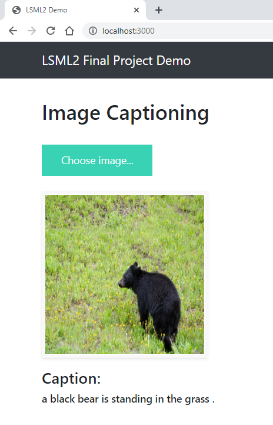

# Image Captioning Project
\



## Description

The project aims to build a machine learning application that produces captions to accurately describe images.


## Requirements

- Docker
- Docker Compose


## Installation

```bash
$ git clone ...
$ cd project_root_directory
$ docker-compose build
$ docker-compose up
```
After the installation the following urls are available:
- http://localhost:3000  - Application Frontend
- http://localhost:4000  - Jupyter Lab
- http://localhost:5000  - MLflow


## Project Architecture

The project includes the following services:
- **Flask:** web server
- **Celery:** handles asynchronous tasks
- **Redis:** provides a data store and a message broker for Celery
- **MLflow:** tracks ML model training runs, stores model artifacts
- **Jupyter:** used for training ML models


## ML Model


## Training Dataset

The training dataset consists of vecrotized images from MSCOCO and text descriptions for the images.


## Loss Function

- Cross Entropy


## How to train a new model

- Go to Jupyter Lab url (the link is above), open **train.ipynb** from the project's root directory.
- Run the entire notebook, at the end of it the trained model will be saved as an artifact in MLflow.
- Restart all project services. The application will pick up the last trained model and use it for generating new captions.
